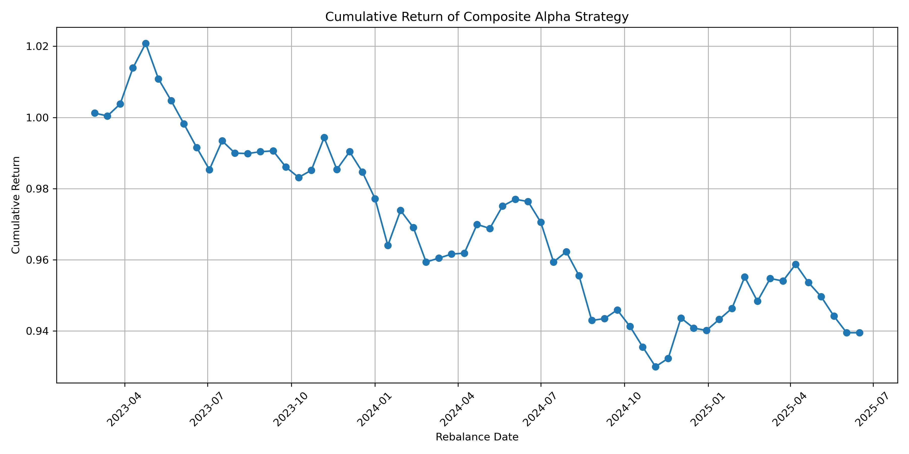

# Quant Research Practice Projects

This repository contains hands-on projects for preparing quantitative research and data roles in finance/FinTech, using real-world datasets and SQL schemas.

---

## 📈 Apple Stock Data Analysis (Python + pandas)

- Cleaned and filtered Apple stock data
- Renamed columns and parsed dates
- Visualized closing prices using matplotlib
- Exported cleaned dataset to CSV

---

## 💾 SQL Practice: Stocks, Sectors, Funds & Investments

- Created realistic schemas for stock markets and asset management
- Ran JOINs, aggregations, and filters
- Used GROUP BY, HAVING, and subqueries
- Identified unallocated funds using LEFT JOIN
- Practiced identifying top performers by sector

---

### 🔍 Feature Engineering & Signal Logic

- Extended the Apple dataset with:
  - 7-Day Moving Average (MA_7)
  - 14-Day Volatility (rolling std)
  - Daily Returns (% change)
  - Simple Buy Signal: Close > MA_7
- Saved processed data as CSV: `apple_with_signals.csv`
- Saved visual chart of price + signal overlay: `apple_ma7_signal.png`

🖼 **Preview:**

---

## 📊  NIFTY vs BANKNIFTY Comparative Analysis (2023–2025)

- Downloaded historical daily prices for NIFTY and BANKNIFTY using yfinance
- Normalized both indices to a base value of 100 for fair comparison
- Visualized relative performance on a single plot
- Exported chart and data for further analysis

📘 [View Notebook](./Nifty_banknifty_compare.ipynb)

🖼 *Chart Preview:*

📄 [Download Normalized Data (CSV)](./nifty_banknifty_normalized.csv)

---

## 📈 XAUUSD MA Strategy Backtest

Tests a simple moving average crossover on gold (XAUUSD).  
Buy when `Close > MA(7)`, hold for 5 days, exit.

- Trades: 49
- Avg Return/Trade: 0.14%
- Cumulative Return: +7.18%

📘 [View Notebook](./xauusd_ma_backtest.ipynb)

## 🛠 Tools Used

- Python (pandas, matplotlib)
- SQL (SQLite via Jupyter)
- GitHub for version control

---

## 🔍 EURUSD Candlestick Pattern Detection

This project detects classic candlestick patterns using daily OHLC data for EURUSD (Jan–Jun 2025):

- 📍 Doji (indecision)
- 🔺 Bullish Engulfing (bullish reversal)
- 💎 Hammer (bullish reversal with long wick)

Each pattern is marked on an interactive Plotly candlestick chart.

📘 [View Notebook](./5.eurusd_candlestick_patterns.ipynb)  
📊 [View Interactive Chart](./5.eurusd_candlestick_patterns.html)  
📄 [View Labeled Dataset](./5.EURUSD_patterns_2025.csv)

---

## 🔁 ETF Rebalance Flow Simulation

This project simulates how an ETF (₹100 crore) tracking a stock index would rebalance its portfolio when index weights change.

### 🔍 What It Does:
- Calculates stock-wise fund flows (buy/sell ₹ crores)
- Estimates impact based on daily traded volume
- Highlights high-pressure names
- Visualizes results using bar charts

### 📂 Files:
- `6.mock_index_rebalance_data.csv`: Input dataset with index weights before/after
- `6.index_rebalance_flows.ipynb`: Full logic + visualizations
- `6.ETF_rebalance_simulation_output.csv`: Output with all computed flow metrics

---

## 🔁 NIFTY50 June 2025 Real Rebalance Simulation

This project simulates a ₹1000 crore ETF rebalancing based on the upcoming June 2025 NIFTY50 index changes (e.g., addition of BSE, INDIGO; removal of INDUSINDBK, HEROMOTOCO).

### 🧠 What It Does:
- Calculates ETF buy/sell flows per stock
- Estimates flow pressure as % of daily traded volume
- Highlights most impacted stocks (possible price reaction)
- Real-world inspired: based on predicted NIFTY changes

### 📂 Files:
- `7.nifty50_june2025_rebalance.csv`: Input stock weight + volume data
- `7.real_nifty_rebalance.ipynb`: Full logic + visualizations
- `7.NIFTY50_June2025_Rebalance_Output.csv`: Output dataset with flows and pressure metrics

---

## 📈 Alpha Factor Engineering (Momentum + Volatility)

This notebook demonstrates how to build technical alpha factors from real stock data.

### 🧪 What It Does:
- Loads real OHLCV data for 10 NIFTY stocks (2023–2025)
- Cleans missing data, removes duplicates
- Calculates:
  - 20-day Momentum (past return)
  - 20-day Volatility (risk measure)
- Ranks stocks by momentum

### 📂 Files:
- `8.nifty_alpha_factors_unclean.csv`: Raw messy stock data
- `8.nifty_alpha_factors_cleaned.csv`: Cleaned dataset with features
- `8.alpha_factor_engineering.ipynb`: Full logic + ranking snapshot

---

## 🔁 Long-Short Momentum Strategy Backtest

This notebook simulates a momentum-based long-short strategy:
- ✅ Long top 3 stocks by 20-day momentum
- ❌ Short bottom 3 stocks
- 📆 Holding period: 10 business days
- 🔁 Rebalanced every 10 days

### 🧠 Signals Used:
- 20-day return (Momentum)
- Equal weighting, no leverage or stop loss

### 📊 Outputs:
- Cumulative return graph
- Full trade log with tickers and PnL

### 📂 Files:
- `9.alpha_strategy_backtest.ipynb`
- `9.momentum_strategy_returns.csv`

### 🧪 Strategy Comparison: Raw vs Filtered

This notebook also compares:
- Raw momentum signal (top/bottom 3 by 20-day return)
- Volatility-filtered version (removes top 25% volatile stocks)

📊 Results:
- Strategy smoothness improves
- Return quality is more stable

📂 New Files:
- `9.momentum_strategy_filtered_returns.csv`

---

# 📈 Multi-Signal Alpha Strategy (Momentum + Volatility)

This project builds a composite alpha-generating strategy by combining two technical factors — **Momentum** and **Volatility** — using cleaned price data of NIFTY50 stocks.

---

## 🔍 Objective

Simulate a simple long-short equity strategy based on:
- **Momentum (20-day)**: Prior performance trend
- **Volatility (20-day)**: Normalized price fluctuation

The goal is to allocate capital to stocks showing strong positive momentum with low volatility (longs) and short those with negative momentum and/or high volatility.

---

## 🧹 Data Preprocessing

- ✅ Removed missing values (`NaN`)
- ✅ Eliminated duplicates
- ✅ Converted `Date` to datetime format
- ✅ Checked for consistency in volume & price columns

---

## ⚙️ Strategy Logic

- For every 10th trading day (rolling window):
  - Rank all stocks by:
    - High momentum → top 3 **long**
    - Low momentum → bottom 3 **short**
  - Track holding period for 10 days
  - Compute returns for each stock in the portfolio
  - Log average strategy return per rebalance period

---

## 📊 Visual Output

A **line chart** showing how the strategy's cumulative returns evolve over time:

|  |
|:--:|
| *Cumulative Strategy Return Over Time* |

---

## 📝 Output Files

- `10.composite_alpha_strategy.ipynb` → Strategy notebook
- `10.composite_alpha_strategy.csv` → Final strategy returns, long/short picks
- `10.composite_alpha_strategy.png` → Cumulative return chart

---

## 💡 Next Steps (Optional Enhancements)
- Add Sharpe ratio or CAGR metrics
- Compare vs NIFTY50 benchmark
- Try factor weighting: `0.7 * Momentum + 0.3 * Volatility`
- Add risk management layer (e.g. max drawdown constraint)

---

## 🛠️ Skills Applied
- Data cleaning and feature engineering
- Rolling window backtesting
- Long/short equity logic
- Matplotlib & pandas plotting

---

## 🔗 Author

Chirag Puthran  
📧 chiragputhran31@gmail.com  
🌐 [LinkedIn](https://linkedin.com/in/chirag-puthran-01a316208)
